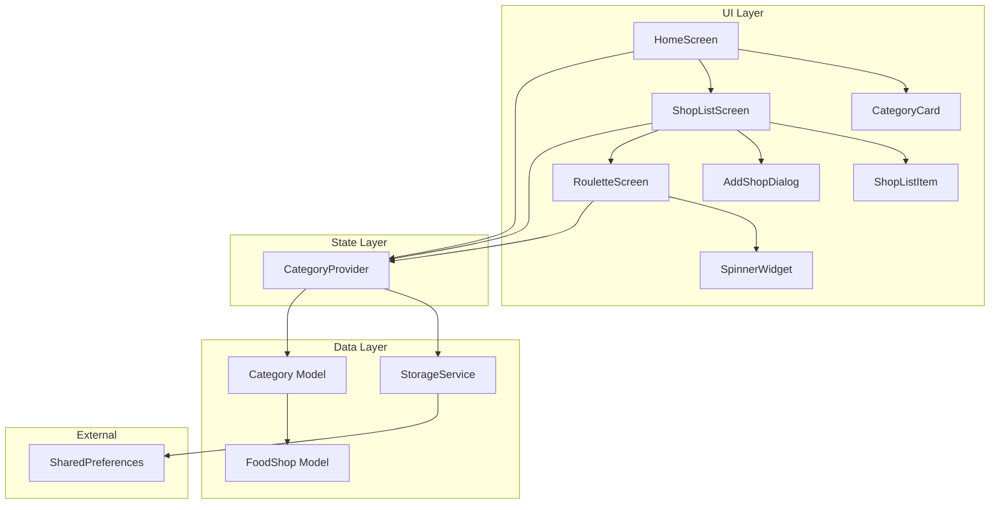
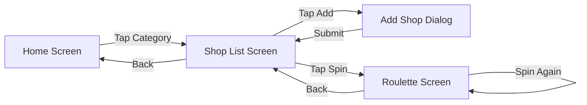

# Design Document

## Overview

Food Roulette is a Flutter/Dart mobile application that helps users overcome decision fatigue around meal choices. The app presents five meal categories on its home screen, allows users to manage food shop lists within each category, persists data locally, and provides an animated roulette spinner for random shop selection.

The application follows a clean, layered architecture with separation between UI (screens/widgets), state management, data models, and storage. It targets both Android and iOS via Flutter's cross-platform framework.

### Key Design Decisions

- **State Management**: Provider pattern — lightweight, well-supported, and appropriate for an app of this scope without needing heavier solutions like Bloc or Riverpod
- **Local Storage**: SharedPreferences — suitable for storing small structured data (JSON-encoded lists of shop names per category); no need for SQLite given the simple data model
- **Animation**: Flutter's built-in animation controllers — provide smooth roulette spinning without external dependencies
- **Architecture**: Feature-first folder structure with separation of models, screens, widgets, providers, and services

## Architecture



### Navigation Flow



### Layer Responsibilities

| Layer | Responsibility |
|-------|---------------|
| UI Layer | Renders screens, handles user input, displays animations |
| State Layer | Manages category/shop data in memory, coordinates between UI and storage |
| Data Layer | Defines models, handles serialization, manages persistent storage |

## Components and Interfaces

### Screens

#### HomeScreen
The root screen displaying five category cards in a scrollable grid/list layout.

```dart
class HomeScreen extends StatelessWidget {
  // Builds a scaffold with an app bar and grid of CategoryCards
  Widget build(BuildContext context);
}
```

#### ShopListScreen
Displays the food shops for a selected category with add/remove capabilities and a spin button.

```dart
class ShopListScreen extends StatelessWidget {
  final MealCategory category;
  
  // Builds the shop list with FAB for adding and a spin button
  Widget build(BuildContext context);
}
```

#### RouletteScreen
Animated spinner that randomly selects a food shop from the category's list.

```dart
class RouletteScreen extends StatefulWidget {
  final MealCategory category;
  
  // Creates the roulette state
  State<RouletteScreen> createState();
}

class _RouletteScreenState extends State<RouletteScreen>
    with SingleTickerProviderStateMixin {
  late AnimationController _controller;
  
  // Initiates the spin animation and random selection
  void _startSpin();
  
  // Selects a random shop with uniform distribution
  FoodShop _pickRandomShop(List<FoodShop> shops);
}
```

### Widgets

#### CategoryCard
A tappable card representing a meal category with its unique color and icon.

```dart
class CategoryCard extends StatelessWidget {
  final MealCategory category;
  final VoidCallback onTap;
  
  Widget build(BuildContext context);
}
```

#### ShopListItem
A dismissible list tile showing a food shop name with delete action.

```dart
class ShopListItem extends StatelessWidget {
  final FoodShop shop;
  final VoidCallback onRemove;
  
  Widget build(BuildContext context);
}
```

#### AddShopDialog
A dialog with a text field for entering a new food shop name, with validation.

```dart
class AddShopDialog extends StatefulWidget {
  final MealCategory category;
  
  State<AddShopDialog> createState();
}

class _AddShopDialogState extends State<AddShopDialog> {
  final TextEditingController _nameController;
  String? _errorText;
  
  // Validates input: non-empty, non-whitespace, 1-50 chars, no duplicates
  String? _validate(String value, List<FoodShop> existingShops);
  
  // Submits the validated shop name
  void _submit();
}
```

#### SpinnerWidget
The animated wheel/spinner visual component.

```dart
class SpinnerWidget extends StatelessWidget {
  final Animation<double> animation;
  final List<FoodShop> shops;
  final FoodShop? selectedShop;
  
  Widget build(BuildContext context);
}
```

### Providers

#### CategoryProvider
Manages all category and shop state, coordinates with storage.

```dart
class CategoryProvider extends ChangeNotifier {
  final StorageService _storageService;
  Map<MealCategory, List<FoodShop>> _shopLists;
  
  // Loads saved data from storage on initialization
  Future<void> loadData();
  
  // Returns the shop list for a given category
  List<FoodShop> getShops(MealCategory category);
  
  // Adds a shop to a category, validates, persists, and notifies listeners
  Future<AddShopResult> addShop(MealCategory category, String name);
  
  // Removes a shop from a category, persists, and notifies listeners
  Future<RemoveShopResult> removeShop(MealCategory category, FoodShop shop);
  
  // Picks a random shop from the category with uniform distribution
  FoodShop? pickRandom(MealCategory category);
}
```

### Services

#### StorageService
Handles reading/writing shop lists to SharedPreferences.

```dart
class StorageService {
  static const String _storageKey = 'food_roulette_data';
  
  // Saves all shop lists as JSON to SharedPreferences
  Future<bool> saveShopLists(Map<MealCategory, List<FoodShop>> data);
  
  // Loads shop lists from SharedPreferences, returns null if unavailable/corrupt
  Future<Map<MealCategory, List<FoodShop>>?> loadShopLists();
}
```

## Data Models

### MealCategory (Enum)

```dart
enum MealCategory {
  breakfast('Breakfast', Color(0xFFFF8A65), Icons.free_breakfast),
  lunch('Lunch', Color(0xFFFFD54F), Icons.lunch_dining),
  teaTime('Tea Time', Color(0xFF81C784), Icons.local_cafe),
  dinner('Dinner', Color(0xFF64B5F6), Icons.dinner_dining),
  supper('Supper', Color(0xFFCE93D8), Icons.nightlight_round);

  final String displayName;
  final Color color;
  final IconData icon;

  const MealCategory(this.displayName, this.color, this.icon);
}
```

### FoodShop

```dart
class FoodShop {
  final String name;
  final DateTime createdAt;

  const FoodShop({required this.name, required this.createdAt});

  // JSON serialization
  Map<String, dynamic> toJson();
  factory FoodShop.fromJson(Map<String, dynamic> json);
  
  // Equality based on name (case-insensitive) within same category
  @override
  bool operator ==(Object other);
  
  @override
  int get hashCode;
}
```

### AddShopResult / RemoveShopResult

```dart
enum AddShopResult { success, emptyName, duplicateName, storageFailed }
enum RemoveShopResult { success, storageFailed }
```

### Storage Schema (JSON in SharedPreferences)

```json
{
  "breakfast": [
    {"name": "Kedai Roti Bakar", "createdAt": "2024-01-15T08:30:00.000Z"}
  ],
  "lunch": [
    {"name": "Nasi Kandar Pelita", "createdAt": "2024-01-15T12:00:00.000Z"},
    {"name": "MCD", "createdAt": "2024-01-16T12:00:00.000Z"}
  ],
  "teaTime": [],
  "dinner": [],
  "supper": []
}
```

The JSON key maps to `MealCategory.name` (the enum value name). Each shop is stored with its name and creation timestamp, preserving insertion order.


## Correctness Properties

*A property is a characteristic or behavior that should hold true across all valid executions of a system — essentially, a formal statement about what the system should do. Properties serve as the bridge between human-readable specifications and machine-verifiable correctness guarantees.*

### Property 1: Category colors are unique

*For any* two distinct MealCategory values, their assigned colors must be different.

**Validates: Requirements 1.2, 5.1**

### Property 2: Adding a valid shop grows the list

*For any* Category and any valid shop name (1-50 non-whitespace-only characters, not already present in the category), adding the shop to the category's list shall result in the list length increasing by exactly one and the new entry appearing at the end of the list.

**Validates: Requirements 2.1**

### Property 3: Whitespace-only names are rejected

*For any* string composed entirely of whitespace characters (including the empty string), attempting to add it as a shop name shall be rejected, and the category's shop list shall remain unchanged.

**Validates: Requirements 2.2**

### Property 4: Removing a shop shrinks the list

*For any* Category with at least one shop, removing a shop from the list shall result in the list length decreasing by exactly one and the removed shop no longer appearing in the list, while all other entries retain their relative order.

**Validates: Requirements 2.3**

### Property 5: Case-insensitive duplicate rejection

*For any* existing shop name in a category, attempting to add a name that differs only in letter casing shall be rejected, and the category's shop list shall remain unchanged.

**Validates: Requirements 2.5**

### Property 6: Storage round-trip preserves data and order

*For any* valid collection of shop lists across all categories, serializing the data to JSON and then deserializing it shall produce an equivalent collection where each category contains the same shops in the same order.

**Validates: Requirements 3.2**

### Property 7: Invalid storage data yields empty lists

*For any* malformed or unparseable string stored in SharedPreferences, loading shop lists shall return null (signaling the provider to start with empty lists) rather than throwing an exception.

**Validates: Requirements 3.3**

### Property 8: Random pick is always a list member

*For any* category with two or more shops, calling pickRandom shall return a FoodShop that exists in that category's shop list.

**Validates: Requirements 4.1**

### Property 9: Uniform random distribution

*For any* category with N shops (N ≥ 2), over a large number of pickRandom calls, each shop shall be selected approximately 1/N of the time within statistical tolerance.

**Validates: Requirements 4.5**

## Error Handling

### Storage Failures

| Scenario | Behavior |
|----------|----------|
| SharedPreferences unavailable on load | Return empty lists for all categories, display informational message |
| Corrupted/unparseable JSON on load | Return empty lists for all categories, display informational message |
| Save operation fails | Return `storageFailed` result, retain in-memory state, display error snackbar |

### Validation Errors

| Scenario | Behavior |
|----------|----------|
| Empty or whitespace-only shop name | Show inline error text "Shop name is required", reject entry |
| Name exceeds 50 characters | Show inline error text "Name must be 50 characters or less", reject entry |
| Duplicate name (case-insensitive) | Show inline error text "This shop already exists", reject entry |

### Roulette Edge Cases

| Scenario | Behavior |
|----------|----------|
| Category has 0 shops | Show message "Add at least 2 shops to spin the roulette" |
| Category has 1 shop | Show message "Add at least 2 shops to spin the roulette" |
| Spin triggered while animation in progress | Ignore the tap (button disabled during spin) |

### General Error Strategy

- All errors are non-fatal — the app continues operating with in-memory state
- Storage errors are surfaced via SnackBar messages
- Validation errors are shown inline next to the input field
- No uncaught exceptions should reach the user; all error paths return typed results

## Testing Strategy

### Property-Based Tests (using `dart_test` with `glados` package)

Property-based testing is appropriate for this feature because:
- The core logic (validation, serialization, random selection) consists of pure functions with clear input/output behavior
- Universal properties hold across wide input spaces (any valid string, any list of shops)
- Input variation reveals edge cases (unicode characters, boundary lengths, mixed casing)

**Configuration:**
- Minimum 100 iterations per property test
- Each test tagged with: `Feature: food-roulette-app, Property {number}: {property_text}`
- Use `glados` for Dart property-based testing (generates random inputs automatically)

**Property tests to implement:**
1. Category color uniqueness (Property 1)
2. Valid shop addition grows list (Property 2)
3. Whitespace rejection (Property 3)
4. Shop removal shrinks list (Property 4)
5. Case-insensitive duplicate rejection (Property 5)
6. JSON serialization round-trip (Property 6)
7. Invalid JSON handling (Property 7)
8. Random pick membership (Property 8)
9. Uniform distribution statistical test (Property 9)

### Unit Tests (using `flutter_test`)

Unit tests cover specific examples and edge cases:
- Adding a shop with exactly 1 character name succeeds
- Adding a shop with exactly 50 characters name succeeds
- Adding a shop with 51 characters name fails
- Removing the only shop from a list with one entry results in an empty list
- Loading from an empty SharedPreferences key returns null
- Save failure returns correct result code
- Animation duration is between 2 and 5 seconds
- Each category card has correct label and icon

### Widget Tests (using `flutter_test`)

- HomeScreen renders exactly 5 category cards
- Tapping a category card navigates to ShopListScreen with correct category
- AddShopDialog shows validation errors for invalid input
- ShopListScreen displays shops in insertion order
- RouletteScreen shows result after animation completes
- Spin-again button is available after result display
- Minimum-shops message shown when category has fewer than 2 shops

### Integration Tests (using `integration_test` package)

- Full flow: launch → tap category → add shop → verify persistence → relaunch → verify loaded
- Full flow: add multiple shops → spin roulette → verify result is from the list
- Storage failure recovery: corrupt stored data → launch → verify empty state with message
